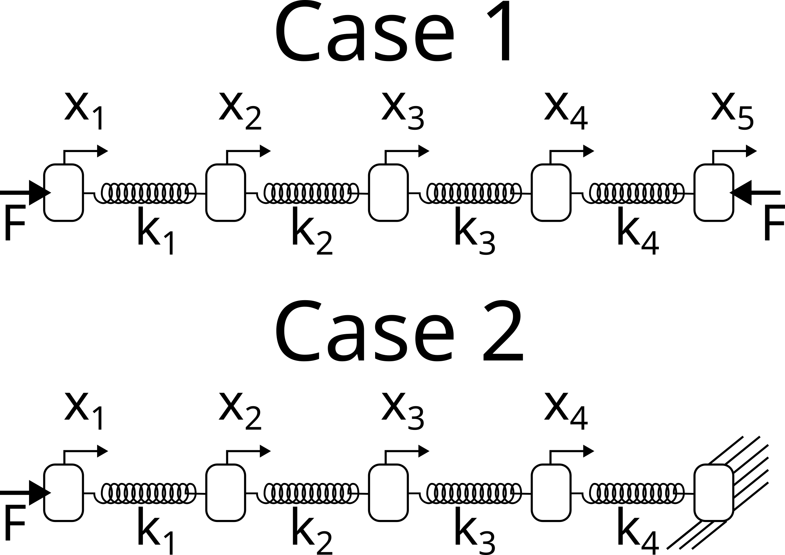

---
jupytext:
  formats: notebooks//ipynb,md:myst
  text_representation:
    extension: .md
    format_name: myst
    format_version: 0.13
    jupytext_version: 1.11.4
kernelspec:
  display_name: Python 3 (ipykernel)
  language: python
  name: python3
---

# Homework
## Problems [Part 1](./01_Linear-Algebra.md)

1. Consider the following pistons connected in series. You want to find
   the distance each piston moves when equal and opposite forces are
   applied to each side. In case 1, you consider the motion of all five
   pistons, but in case 2 you set the motion of piston 5 to 0. 



Using a FBD for each piston, in case 1:

$k_1x_{1}-k_2x_{2}=F$

$(k_1 +k_2)x_2 -k_1x_1 - k_2x_3 = 0$

$(k_2 +k_3)x_3 -k_2x_2 - k_3x_4 = 0$

$(k_3 +k_4)x_4 -k_3x_3 - k_4x_5 = 0$

$k_4x_5 - k_4x_4 = -F$

in matrix form:

$\left[ \begin{array}{ccccc}
k_1 & -k_1 & 0 & 0 & 0\\
-k_1 & k_1+k_2 & -k_2 & 0 & 0 \\
0 & -k_2 & k_2+k_3 & -k_3 & 0\\
0 & 0 & -k_3 & k_3+k_4 & -k_4\\
0 & 0 & 0 & -k_4 & k_4  
\end{array} \right]
\left[ \begin{array}{c}
x_{1} \\
x_{2} \\
x_{3} \\
x_{4} \\
x_{5}\end{array} \right]=
\left[ \begin{array}{c}
F \\
0 \\
0 \\
0 \\
-F \end{array} \right]$

Try to use `np.linalg.solve` to find the piston x-positions. Do you get
any warnings or errors?

```{code-cell} ipython3
import numpy as np
```

```{code-cell} ipython3
k1, k2, k3, k4 = 1, 1, 1, 1
F = 1

A = np.array([[ k1,     -k1,       0,       0,   0], 
              [-k1, k1 + k2,     -k2,       0,   0], 
              [  0,     -k2, k2 + k3,     -k3,   0], 
              [  0,       0,     -k3, k3 + k4, -k4], 
              [  0,       0,       0,     -k4,  k4]])
b = np.array([F, 0, 0, 0, F])

try:
    np.linalg.solve(A, b)
except Exception as e:
    print(f'Error: {e} because |A| = {np.linalg.det(A)}')
```

Now, consider case 2, 

Using a FBD for each piston, in case 2:

$k_1x_{1}-k_2x_{2}=F$

$(k_1 +k_2)x_2 -k_1x_1 - k_2x_3 = 0$

$(k_2 +k_3)x_3 -k_2x_2 - k_3x_4 = 0$

$(k_3 +k_4)x_4 -k_3x_3 = 0$

in matrix form:

$\left[ \begin{array}{cccc}
k_1 & -k_1 & 0 & 0 \\
-k_1 & k_1+k_2 & -k_2 & 0 \\
0 & -k_2 & k_2+k_3 & -k_3 \\
0 & 0 & -k_3 & k_3+k_4 \\
\end{array} \right]
\left[ \begin{array}{c}
x_{1} \\
x_{2} \\
x_{3} \\
x_{4} \end{array} \right]=
\left[ \begin{array}{c}
F \\
0 \\
0 \\
0 \end{array} \right]$

Try to use `np.linalg.solve` to find the piston x-positions. Do you get
any warnings or errors? Why does this solution work better [hint: check
condition
numbers](./01_Linear-Algebra.md#Singular-and-ill-conditioned-matrices)

```{code-cell} ipython3
A = np.array([[ k1,     -k1,       0,       0], 
              [-k1, k1 + k2,     -k2,       0], 
              [  0,     -k2, k2 + k3,     -k3], 
              [  0,       0,     -k3, k3 + k4]])
b = np.array([F, 0, 0, 0])
np.linalg.solve(A, b)
```


2. In the figure above you have an idealized Heating, Ventilation and Air conditioning (HVAC) system. In the current configuration, the three-room building is being cooled off by $15^oC$ air fed into the building at 0.1 kg/s. Our goal is to determine the steady-state temperatures of the rooms given the following information

* $\dot{m}_1=0.1~kg/s$
* $\dot{m}_2=0.12~kg/s$
* $\dot{m}_3=0.12~kg/s$
* $\dot{m}_4=0.1~kg/s$
* $\dot{m}_5=0.02~kg/s$
* $\dot{m}_6=0.02~kg/s$
* $C_p=1000~\frac{J}{kg-K}$
* $\dot{Q}_{in} = 300~W$
* $T_{in} = 12^{o} C$

The energy-balance equations for rooms 1-3 create three equations:

1. $\dot{m}_1 C_p T_{in}+\dot{Q}_{in}-\dot{m}_2 C_p T_{1}+\dot{m}_6 C_p T_{2} = 0$

2. $\dot{m}_2 C_p T_{1}+\dot{Q}_{in}+\dot{m}_5 C_p T_{3}-\dot{m}_3 C_p T_{2}-\dot{m}_6 C_p T_{2} = 0$

3. $\dot{m}_3 C_p T_{2}+\dot{Q}_{in}-\dot{m}_5 C_p T_{3}-\dot{m}_4 C_p T_{3} = 0$

Identify the unknown variables and constants to create a linear algebra problem in the form of $\mathbf{Ax}=\mathbf{b}$.

a. Create the matrix $\mathbf{A}$

b. Create the known vector $\mathbf{b}$

c. Solve for the unknown variables, $\mathbf{x}$

d. What are the warmest and coldest rooms? What are their temperatures?

+++

$\left[ \begin{array}{ccc}
\dot{m}_2 & -\dot{m}_6 & 0 \\
-\dot{m}_2 & \dot{m}_3 + \dot{m}_6 & -\dot{m}_5 \\
0 & -\dot{m}_3 & \dot{m}_4 + \dot{m}_5 \\ \end{array} \right]
\left[ \begin{array}{c}
T_{1} \\
T_{2} \\
T_{3} \end{array} \right]=
\left[ \begin{array}{c}
\frac{\dot{Q}_{in}}{C_p} +  \dot{m}_1 T_{in}\\
\frac{\dot{Q}_{in}}{C_p} \\
\frac{\dot{Q}_{in}}{C_p} \\ \end{array} \right]$

```{code-cell} ipython3
m1, m2, m3, m4, m5, m6 = .1, .12, .12, .1, .02, .02
Cp = 1000
Qin = 300
Tin = 12

A = np.array([[m2, -m6, 0], [-m2, m3+m6, -m5], [0, -m3, m4+m5]])
b = np.array([Qin/Cp + m1*Tin, Qin/Cp, Qin/Cp])

T = np.linalg.solve(A, b)
for i, t in enumerate(T, 1):
    print(f'Temp in Room {i}: {t:.2f}°C')
```

3. The [Hilbert Matrix](https://en.wikipedia.org/wiki/Hilbert_matrix) has a high condition number and as the matrix increases dimensions, the condition number increases. Find the condition number of a 

a. $1 \times 1$ Hilbert matrix

b. $5 \times 5$ Hilbert matrix

c. $10 \times 10$ Hilbert matrix

d. $15 \times 15$ Hilbert matrix

e. $20 \times 20$ Hilbert matrix

If the accuracy of each matrix element is $\approx 10^{-16}$, what is the expected rounding error in the solution $\mathbf{Ax} = \mathbf{b}$, where $\mathbf{A}$ is the Hilbert matrix.

```{code-cell} ipython3
def makeHilbert(N):
    return np.array([[1/(i + j + 1) for i in range(N)] for j in range(N)])


for n in 1, 5, 10, 15, 20:
    condition = np.linalg.cond(makeHilbert(n))
    print(f"{n}x{n} Hilbert matrix:")
    print(f"\tCondition:\t{condition:.2e}")
    print(f"\tError:\t\t{10**(np.log10(condition) - 16):.2e}\n")
```

## Problems [Part 2](./02_Gauss_elimination.md)

1. 4 masses are connected in series to 4 springs with K=100N/m. What are the final positions of the masses? 


The masses haves the following amounts, 1, 2, 3, and 4 kg for masses 1-4. Using a FBD for each mass:

$m_{1}g+k(x_{2}-x_{1})-kx_{1}=0$

$m_{2}g+k(x_{3}-x_{2})-k(x_{2}-x_{1})=0$

$m_{3}g+k(x_{4}-x_{3})-k(x_{3}-x_{2})=0$

$m_{4}g-k(x_{4}-x_{3})=0$

in matrix form K=100 N/m:

$\left[ \begin{array}{cccc}
2k & -k & 0 & 0 \\
-k & 2k & -k & 0 \\
0 & -k & 2k & -k \\
0 & 0 & -k & k \end{array} \right]
\left[ \begin{array}{c}
x_{1} \\
x_{2} \\
x_{3} \\
x_{4} \end{array} \right]=
\left[ \begin{array}{c}
m_{1}g \\
m_{2}g \\
m_{3}g \\
m_{4}g \end{array} \right]$

```{code-cell} ipython3
m1, m2, m3, m4 = 1, 2, 3, 4
g = 9.81
k = 100

A = np.array([[2*k,  -k,   0,  0], 
              [ -k, 2*k,  -k,  0], 
              [  0,  -k, 2*k, -k], 
              [  0,   0,  -k,  k]])
b = g * np.array([m1, m2, m3, m4])

x = np.linalg.solve(A, b)
for i, x in enumerate(x, 1):
    print(f'Final position of m{i}: {x:.3f}m')
```


For problems __2-3__, consider the simple 3-element triangular truss, shown above, with a point load applied at the tip. The goal is to understand what tension is in the horizontal element, $P_1$. In problem __2__, the applied force is verical $(\theta=0)$ and in problem __3__ the applied force varies in angle $(\theta \neq 0)$. 

2. In the truss shown above, calculate the tension in bar 1, $P_1$, when $\theta=0$. When $\theta=0$, the $\sum F=0$ at each corner creates 3 equations and 3 unknowns as such (here, you reduce the number of equations with symmetry, $P_2=P_3,~R_2=R_3,~and~R_1=0$ ). 

$\left[ \begin{array}{ccc}
1 & \cos\alpha & 0 \\
0 & 2\sin\alpha & 0 \\
0 & -\sin\alpha &  1 \\
 \end{array} \right]
\left[ \begin{array}{c}
P_{1} \\
P_{2} \\
R_{2} \end{array} \right]=
\left[ \begin{array}{c}
0 \\
F \\
0 \end{array} \right]$

a. Create the system of equations, $\mathbf{Ax}=\mathbf{b}$, when $\alpha=75^o$, $\beta=30^o$, and $F=1~kN$. Use __Gauss elimination__ to solve for $P_1,~P_2,~and~R_2$. What is the resulting augmented matrix, $\mathbf{A|y}$ after Gauss elimination?

b. Solve for the $\mathbf{LU}$ decomposition of $\mathbf{A}$. 

c. Use the $\mathbf{LU}$ solution to solve for the tension in bar 1 $(P_1)$ every 10 N values of force, F, between 100 N and 1100 N. Plot $P_1~vs~F$.

```{code-cell} ipython3
from scipy.linalg import lu
def GaussNaive(A,y):
    '''GaussNaive: naive Gauss elimination
    x = GaussNaive(A,b): Gauss elimination without pivoting.
    solution method requires floating point numbers, 
    as such the dtype is changed to float
    
    Arguments:
    ----------
    A = coefficient matrix
    y = right hand side vector
    returns:
    ---------
    x = solution vector
    Aug = augmented matrix (used for back substitution)'''
    [m,n] = np.shape(A)
    Aug = np.block([A,y.reshape(n,1)])
    Aug = Aug.astype(float)
    if m!=n: error('Matrix A must be square')
    nb = n+1
    # Gauss Elimination 
    for k in range(0,n-1):
        for i in range(k+1,n):
            if Aug[i,k] != 0.0:
                factor = Aug[i,k]/Aug[k,k]
                Aug[i,:] = Aug[i,:] - factor*Aug[k,:]
    # Back substitution
    x=np.zeros(n)
    for k in range(n-1,-1,-1):
        x[k] = (Aug[k,-1] - Aug[k,k+1:n]@x[k+1:n])/Aug[k,k]
    return x,Aug

def solveLU(L,U,b):
    '''solveLU: solve for x when LUx = b
    x = solveLU(L,U,b): solves for x given the lower and upper 
    triangular matrix storage
    uses forward substitution for 
    1. Ly = b
    then backward substitution for
    2. Ux = y
    
    Arguments:
    ----------
    L = Lower triangular matrix
    U = Upper triangular matrix
    b = output vector
    
    returns:
    ---------
    x = solution of LUx=b '''
    n=len(b)
    x=np.zeros(n)
    y=np.zeros(n)
        
    # forward substitution
    for k in range(0,n):
        y[k] = b[k] - L[k,0:k]@y[0:k]
    # backward substitution
    for k in range(n-1,-1,-1):
        x[k] = (y[k] - U[k,k+1:n]@x[k+1:n])/U[k,k]
    return x
```

```{code-cell} ipython3
a = 75 * np.pi/180
F = 1e3

A = np.array([[1, np.cos(a), 0], [0, 2*np.sin(a),0 ], [0, -np.sin(a), 1]])
b = np.array([0, F, 0])
x, aug = GaussNaive(A, b)
print('x=\t\tAug=')
for i in range(len(x)):
    print(f'{x[i]:.2f}\t\t', A[i])
```

```{code-cell} ipython3
_, l, u = lu(A)
print(l)
print(u)
```

```{code-cell} ipython3
import matplotlib.pyplot as plt
```

```{code-cell} ipython3
F = np.arange(100, 1100+1, 10)
P1 = np.zeros(len(F))
for i, f in enumerate(F):
    b = np.array([0, f, 0])
    x = solveLU(L,U,b)
    P1[i] = x[0]
ax = plt.axes(title='$P_1$ vs F', xlabel='F', ylabel='$P_1$')
ax.plot(F, P1);
```

3. Using the same truss as shown above, let's calculate the tension in bar 1, $P_1$, when $\theta=[0...90^o]$ and $F=[100...1100]~kN$. When $\theta\neq 0$, the resulting 6 equations and 6 unknowns are given in the following matrix

$\left[ \begin{array}{ccc}
0 & \sin\alpha & 0 & 1 & 0 & 0 \\
1 & \cos\alpha & 0 & 0 & 1 & 0 \\
0 & \cos\beta/2 & \cos\beta/2 & 0 & 0 & 0 \\
0 & -\sin\beta/2 & \sin\beta/2 & 0 & 0 & 0 \\
-1 & 0 & \cos\alpha & 0 & 0 & 0 \\
0 & 0 & \sin\alpha & 0 & 0 & 1 \\
 \end{array} \right]
\left[ \begin{array}{c}
P_{1} \\
P_{2} \\
P_{3} \\
R_{1} \\
R_{2} \\
R_{3}\end{array} \right]=
\left[ \begin{array}{c}
0 \\
0 \\
F\cos\theta \\
-F\sin\theta \\
0 \\
0 \end{array} \right]$

a. Create the system of equations, $\mathbf{Ax}=\mathbf{b}$, when $\alpha=75^o$, $\beta=30^o$, $\theta=45^o=\pi/4$, and $F=1~kN$. Use __Gauss elimination__ to solve for $P_1,~P_2,~P_3,~R_1,~R_2,~and~R_3$. What is the resulting augmented matrix, $\mathbf{A|y}$ after Gauss elimination? _Hint: do you see a problem with the order of the equations? How can you __pivot__ to fix it?_

b. Solve for the $\mathbf{PLU}$ decomposition of $\mathbf{A}$. 

c. Use the $\mathbf{PLU}$ solution to solve for the tension in bar 1 $(P_1)$ every 10 N values of force, F, between 100 N and 1100 N. Plot $P_1~vs~F$.

```{code-cell} ipython3
alpha = np.pi* 75/180
beta = np.pi/6
theta = np.pi/2

A = np.array([[ 0,   np.sin(alpha),              0, 1, 0, 0],
              [ 1,   np.cos(alpha),              0, 0, 1, 0], 
              [ 0,  np.cos(beta/2), np.cos(beta/2), 0, 0, 0], 
              [ 0, -np.sin(beta/2), np.sin(beta/2), 0, 0, 0], 
              [-1,               0,  np.cos(alpha), 0, 0, 0], 
              [ 0,               0,  np.sin(alpha), 0, 0, 1]])
b = lambda F: np.array([0, 0, F*np.cos(theta), -F*np.sin(theta), 0, 0])
x, aug = GaussNaive(A, b(1000))
print('x=\t\tAug=')
for i in range(len(x)):
    print(f'{x[i]:.2f}\t\t', A[i])
```

The problem with Gaussian Elimination here is that there is 0 elements on the diagonal, interchanging rows can fix this

```{code-cell} ipython3
p, l, u = lu(A)
print(p)
```

```{code-cell} ipython3
F = np.arange(100, 1100+1, 10)
P1 = np.zeros(len(F))
for i, f in enumerate(F):
    x = solveLU(l, u, p.T@b(f))
    P1[i] = x[0]
ax = plt.axes(title='$P_1$ vs F', xlabel='F', ylabel='$P_1$')
ax.plot(F, P1);
```

## Problems [Part 3](./03_Linear-regression-algebra.md)

  

Viscoelastic Prony series model and stress-vs-time relaxation curve of wheat kernels [[3]](https://www.cerealsgrains.org/publications/plexus/cfw/pastissues/2013/Documents/CFW-58-3-0139.pdf). Stress relaxation curve of a wheat kernel from regressed equation data that illustrate where to locate relaxation times (vertical dotted lines) and stresses (horizontal black marks). $\sigma$ = stress; t = time.

2. [Viscoelasticity](https://en.wikipedia.org/wiki/Viscoelasticity) is a property of materials that exhibit stiffness, but also tend to flow slowly. One example is [Silly Putty](https://en.wikipedia.org/wiki/Silly_Putty), when you throw a lump it bounces, but if you leave it on a table it _creeps_, slowly flowing downwards. In the stress-vs-time plot above, a wheat kernel was placed under constant strain and the stress was recorded. In a purely elastic material, the stress would be constant. In a purely viscous material, the stress would decay to 0 MPa. 

Here, you have a viscoelastic material, so there is some residual elastic stress as $t\rightarrow \infty$. The researchers used a 4-part [Prony series](https://en.wikipedia.org/wiki/Prony%27s_method) to model viscoelasticity. The function they fit was

$\sigma(t) = a_1 e^{-t/1.78}+a_2 e^{-t/11}+a_3e^{-t/53}+a_4e^{-t/411}+a_5$

a. Load the data from the graph shown above in the file `../data/stress_relax.dat`. 

b. Create a $\mathbf{Z}$-matrix to perform the least-squares regression for the given Prony series equation $\mathbf{y} = \mathbf{Za}$.

c. Solve for the constants, $a_1,~a_2,~a_3,~a_4~,a_5$

d. Plot the best-fit function and the data from `../data/stress_relax.dat` _Use at least 50 points in time to get a smooth best-fit line._

```{code-cell} ipython3
!head ../data/stress_relax.dat
```

```{code-cell} ipython3
t, stress = np.loadtxt('../data/stress_relax.dat', delimiter=',', skiprows=1, unpack=True)
sigma = lambda t: [[np.exp(-t/1.78)], [np.exp(-t/11)], [np.exp(-t/53)], [np.exp(-t/411)], [t**0]]
Z = np.block(sigma(t)).T
a = np.linalg.solve(Z.T@Z,Z.T@stress)
a
```

```{code-cell} ipython3
ax = plt.axes(xlabel='time (sec)', ylabel='stress (MPa)')
ax.plot(t, stress, '.', label='data')
x = np.linspace(min(t), max(t), 50)
fit = np.block(sigma(x)).T
plt.plot(x,fit@a,label=fr'$\sigma(t)$')
ax.legend();
```

3. Load the '../data/primary-energy-consumption-by-region.csv' that has the energy consumption of different regions of the world from 1965 until 2018 [Our world in Data](https://ourworldindata.org/energy). 
You are going to compare the energy consumption of the United States to all of Europe. Load the data into a pandas dataframe. *Note: you can get certain rows of the data frame by specifying what you're looking for e.g. 
`EUR = dataframe[dataframe['Entity']=='Europe']` will give us all the rows from Europe's energy consumption.*

a. Use a piecewise least-squares regression to find a function for the energy consumption as a function of year

energy consumed = $f(t) = At+B+C(t-1970)H(t-1970)$

c. What is your prediction for US energy use in 2025? How about European energy use in 2025?

```{code-cell} ipython3
import pandas as pd
!head ../data/primary-energy-consumption-by-region.csv
```

```{code-cell} ipython3
data = pd.read_csv('../data/primary-energy-consumption-by-region.csv')
EUR = data[data['Entity']=='Europe']
US = data[data['Entity']=='United States']

t, energy = EUR['Year'], EUR['Primary Energy Consumption (terawatt-hours)']
f = lambda t: [[t], [t**0], [(t-1970)*(t>=1970)]]
Z = np.block(f(t)).T
a_eur = np.linalg.solve(Z.T@Z,Z.T@energy)
t, energy = US['Year'], US['Primary Energy Consumption (terawatt-hours)']
Z = np.block(f(t)).T
a_us = np.linalg.solve(Z.T@Z,Z.T@energy)
```

```{code-cell} ipython3
x = np.linspace(min(t), max(t), 50)
fit = np.block(f(x)).T

_, (ax_eur, ax_us) = plt.subplots(1, 2, figsize=(12, 5), sharey=True)
ax_eur.set(title='Europe', xlabel='Year', ylabel='Primary Energy Consumption (TWhr)')
ax_us.set(title='United States', xlabel='Year')

EUR.plot('Year', 'Primary Energy Consumption (terawatt-hours)', linewidth=0, marker='.', ax=ax_eur, label='')
ax_eur.plot(x,fit@a_eur,label='piecewise linear fit')
ax_eur.legend();

US.plot('Year', 'Primary Energy Consumption (terawatt-hours)', linewidth=0, marker='.', ax=ax_us, label='')
ax_us.plot(x,fit@a_us,label='piecewise linear fit')
ax_us.legend();
```

```{code-cell} ipython3
predict2025 = np.block(f(2025)).T

print(f'Predicted energy consumption for Europe in 2025 is {float(predict2025@a_eur):.2f} TWhr')
print(f'Predicted energy consumption for the US in 2025 is {float(predict2025@a_us):.2f} TWhr')
```
